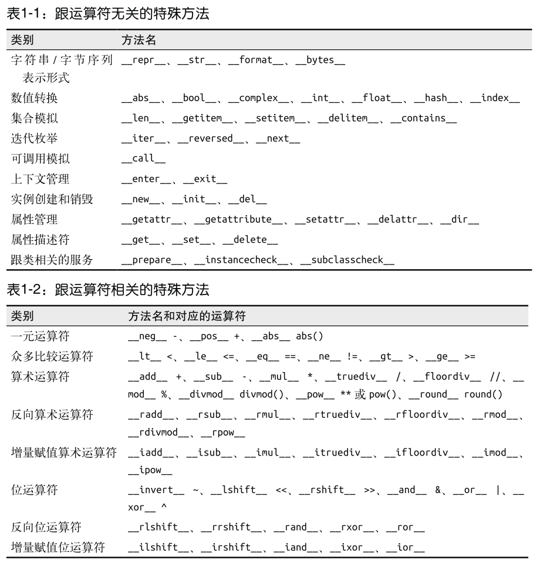

#### 第一章 Python数据模型


魔术方法(magic method): 

```python
# 方法名规则
__name__

# my_collection[key] 解释器实际会调用 my_collection.__getitem__(key)
```


格式化字符串

```python
# % 和 str.format
print('%f' % 1.11)
# 1.110000

print('{0:f}{1}'.format(20, ' hello world'))
# 20.000000 hello world
```


特殊方法

