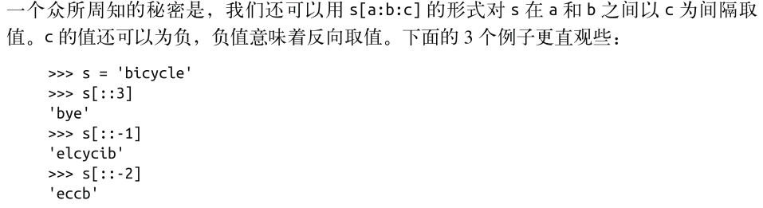
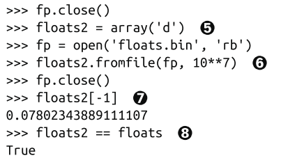

#### 第二章 序列构成的数组


##### Python 风格

- 序列的泛型操作
- 内置的元组和映射类型
- 缩进
- 无需声明变量的类型


##### 容器序列(能存放不同类型的数据)

- list
- tuple
- collections.deque


##### 扁平序列(只能容纳一种类型)

- str
- bytes
- bytearray
- memoryview
- array.array


容器序列存放的是他们所包含的对象的引用，而扁平序列存放的是值


##### 可变序列

- list
- bytearray
- array.array
- collections.deque
- memoryview


##### 不可变序列

- tuple
- str
- bytes


##### 元组拆包

```python
lax_coordinates = (33.9, -118.4)
# 元组拆包
latitude, longitude = lax_coordinates

a, b = b, a

# divmod(x, y)
# Return the tuple (x//y, x%y).
print(divmod(20, 8))
# (2, 4)


print(os.path.split('/home/python/test.py'))
# ('/home/python', 'test.py')
```


##### 用 * 来处理剩下的元素

```python
a, b, *c = range(5)
print(a, b, c)
# 0 1 [2, 3, 4]
```


##### 具名元组

可以用来构建一个带字段名的元组和一个名字的类

构建的类的实例所消耗的内存和元组一样

```python
from collections import namedtuple

# 参数: 类名, 各个字段的名字
City = namedtuple('City', 'name country population coordinates')
print(City._fields)
# ('name', 'country', 'population', 'coordinates')

tokyo = City('Tokyo', 'JP', 36.9, (35.6, 239.6))
print(tokyo)
# City(name='Tokyo', country='JP', population=36.9, coordinates=(35.6, 239.6))

# 人口属性
print(tokyo.population)
# 36.9

# 位置
print(tokyo.coordinates)
# (35.6, 239.6)

# 转字典
print(tokyo._asdict())
# OrderedDict([('name', 'Tokyo'), ('country', 'JP'), ('population', 36.9), ('coordinates', (35.6, 239.6))])
```


##### 元组和列表对比


##### 切片

为什么切片和区间会忽略最后一个元素：0是下标的起始




二维切片

```python
a[m:n, i:j]
```


切片赋值

如果赋值的对象是一个切片，赋值语句的右侧必须是可迭代对象

```python
# 切片赋值
l = list(range(10))
print(l)
# [0, 1, 2, 3, 4, 5, 6, 7, 8, 9]

l[2:5] = [20, 30]
print(l)
# [0, 1, 20, 30, 5, 6, 7, 8, 9]

l[2:5] = 100
# l[2:5] = 100
# TypeError: can only assign an iterable
```


##### 对序列使用 + 和 *

```python
# 对序列使用 + 和 *
board = [['_'] * 3 for i in range(3)]
print(board)
# [['_', '_', '_'], ['_', '_', '_'], ['_', '_', '_']]

board[1][2] = 'x'
print(board)
# [['_', '_', '_'], ['_', '_', 'x'], ['_', '_', '_']]

# 三个列表指向同一对象的引用
board = [['_'] * 3] * 3
print(board)
# [['_', '_', '_'], ['_', '_', '_'], ['_', '_', '_']]

board[1][2] = '0'
print(board)
# [['_', '_', '0'], ['_', '_', '0'], ['_', '_', '0']]
```


##### list.sort 和内置函数sorted

- list.sort 原地排序列表
- sorted 会新建一个列表作为返回值
- 共同的参数：reverse, key


##### bisect模块

主要函数：bisect, insort 都是利用二分


==set 比 list更适合判断是否包含，set为检查元素是否存在做过优化==


##### 数组





##### 内存视图

memoryview.cast会把同一块内存里的内容打包成一个全新的memoryview对象


##### 双向队列和其他形式的队列

.append/.pop方法，可以把列表当作栈或者队列

collections.deque 线程安全，可以快速从两端添加或者删除


方法：

- rotate 旋转
- appendleft 左侧添加
- extend
- extendleft

可选参数

- maxlen 最大容量


